# Dependency Diagram Checkout UI Repo

## Components
- 🔧 C1[Agency Info]
- 🔧 C2[Desktop Billing Info]
- 🔧 C3[Checkout Payment Summary Lib]
- 🔧 C4[Desktop Checkout Payment Summary]
- 🔧 C5[Mobile Billing Info]

## SDKs
- 📦 L1[Checkout Common]
- 📦 L2[Checkout Orxe Lib]
- 📦 L3[Contracts ]

## Apps
- 📱 A1[Desktop Checkout Microapp]
- 📱 A2[Desktop Checkout Microapp v2]
- 📱 A3[Desktop Express]
- 📱 A4[Mobile Checkout Microapp]
- 📱 A5[Mobile Express]

## Sites
- 📱 S1[Desktop Checkout Site]
- 📱 S2[Mobile Checkout Site]

## Relationships
- C1 -->|uses| A1;
- C1 -->|uses| A2;
- C1 -->|uses| A3;
- C1 -->|uses| A4;
- C1 -->|uses| A5;
- C2 -->|uses| A2;
- C2 -->|uses| A3;
- C3 -->|uses| A1;
- C3 -->|uses| A4;
- C3 -->|uses| A5;
- C4 -->|uses| A2;
- C4 -->|uses| A3;
- C5 -->|uses| A4;
- C5 -->|uses| A5;

- L1 -->|used by| A1;
- L1 -->|used by| A2;
- L1 -->|used by| A3;
- L1 -->|used by| A4;
- L2 -->|used by| A1;
- L2 -->|used by| A2;
- L2 -->|used by| A3;
- L2 -->|used by| A4;
- L3 -->|used by| A5;
- L4 -->|used by| S1;
- L4 -->|used by| S2;

# Dependency Diagrams

## Diagram 1: Components and Apps

```mermaid
graph TD;
    %% Define subgraph Components
    subgraph Components
        C1[**🔧 Agency Info**]
        C2[**🔧 Checkout Payment Summary Lib**]
        C3[**🔧 Desktop Checkout Payment Summary**]
        C4[**🔧 Mobile Billing Info**]
        C5[**🔧 Desktop Billing Info**]
    end

    subgraph Apps
        A1[**📱 Desktop Checkout Microapp**]
        A2[**📱 Desktop Checkout Microapp**]
        A3[**📱 Desktop Checkout Microapp**]
        A4[**📱 Desktop Checkout Microapp**]
        A5[**📱 Desktop Checkout Microapp**]
    end

    %% Define relationships
    C1 -->|uses| A1;
    C1 -->|uses| A2;
    C1 -->|uses| A3;
    C1 -->|uses| A4;
    C1 -->|uses| A5;
    C2 -->|uses| A2;
    C2 -->|uses| A3;
    C3 -->|uses| A1;
    C3 -->|uses| A4;
    C3 -->|uses| A5;
    C4 -->|uses| A2;
    C4 -->|uses| A3;
    C5 -->|uses| A4;
    C5 -->|uses| A5;

    %% Adding styles and theming
    style C1 fill:#f96,stroke:#333,stroke-width:2px;
    style C2 fill:#f6b,stroke:#333,stroke-width:2px;
    style C3 fill:#f9c,stroke:#333,stroke-width:2px;
    style C4 fill:#f39,stroke:#333,stroke-width:2px;
    style C5 fill:#f63,stroke:#333,stroke-width:2px;

    style A1 fill:#b3cde3,stroke:#333,stroke-width:2px;
    style A2 fill:#ccebc5,stroke:#333,stroke-width:2px;
    style A3 fill:#decbe4,stroke:#333,stroke-width:2px;
    style A4 fill:#fed9a6,stroke:#333,stroke-width:2px;
    style A5 fill:#ffffcc,stroke:#333,stroke-width:2px;
```

## Diagram 2: SDKs and Apps

```mermaid
graph TD;
    %% Define subgraph SDKs
    subgraph SDKs
        L1[**📦 Checkout Orxe Lib**]
        L2[**📦 Contracts**]
        L3[**📦 Checkout Common**]
        L4[**📦 Shell SDK**]
    end

    subgraph Apps
        A1[**📱 Desktop Checkout Microapp**]
        A2[**📱 Mobile Checkout Microapp**]
        A3[**📱 Mobile Express**]
        A4[**📱 Desktop Express**]
        A5[**📱 Desktop Checkout Microapp v2**]
    end

    %% Define relationships
    L1 -->|used by| A1;
    L1 -->|used by| A2;
    L1 -->|used by| A3;
    L1 -->|used by| A4;
    L2 -->|used by| A1;
    L2 -->|used by| A2;
    L2 -->|used by| A3;
    L2 -->|used by| A4;
    L3 -->|used by| A5;

    %% Adding styles and theming
    style L1 fill:#9cf,stroke:#333,stroke-width:2px;
    style L2 fill:#6cf,stroke:#333,stroke-width:2px;
    style L3 fill:#3cf,stroke:#333,stroke-width:2px;
    style L4 fill:#0cf,stroke:#333,stroke-width:2px;

    style A1 fill:#b3cde3,stroke:#333,stroke-width:2px;
    style A2 fill:#ccebc5,stroke:#333,stroke-width:2px;
    style A3 fill:#decbe4,stroke:#333,stroke-width:2px;
    style A4 fill:#fed9a6,stroke:#333,stroke-width:2px;
    style A5 fill:#ffffcc,stroke:#333,stroke-width:2px;
```

## Diagram 3: SDKs and Sites

```mermaid
graph TD;
    %% Define subgraph SDKs
    subgraph SDKs
        L4[**📦 Shell SDK**]
    end

    subgraph Sites
        S1[**🐳 Desktop Checkout Site**]
        S2[**🐳 Mobile Checkout Site**]
    end

    %% Define relationships
    L4 -->|used by| S1;
    L4 -->|used by| S2;

    %% Adding styles and theming
    style L4 fill:#0cf,stroke:#333,stroke-width:2px;

    style S1 fill:#b3b3b3,stroke:#333,stroke-width:2px;
    style S2 fill:#d9d9d9,stroke:#333,stroke-width:2px;
```

