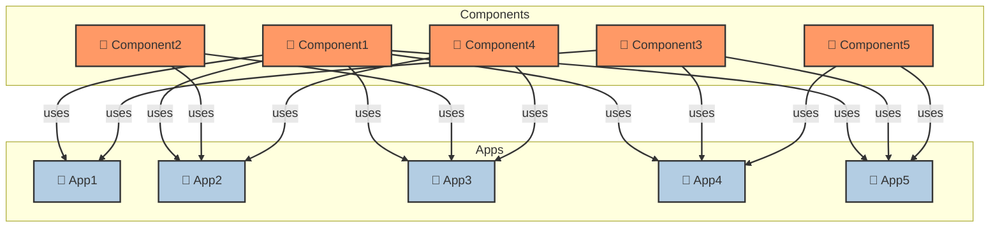
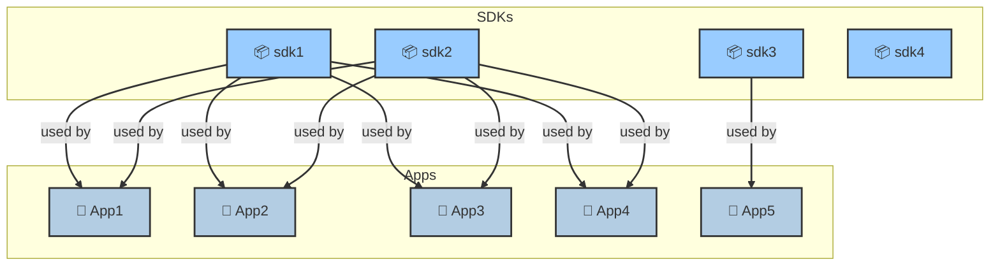
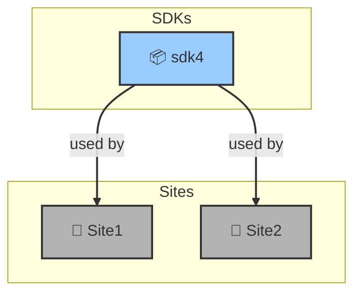

# Dependency Diagrams

## Diagram 1: Components and Apps

```mermaid
graph TD;
    %% Define subgraph Components
    subgraph Components
        C1[🔧 Component1]
        C2[🔧 Component2]
        C3[🔧 Component3]
        C4[🔧 Component4]
        C5[🔧 Component5]
    end

    subgraph Apps
        A1[📱 App1]
        A2[📱 App2]
        A3[📱 App3]
        A4[📱 App4]
        A5[📱 App5]
    end

    %% Define relationships
    C1 -->|uses| A1;
    C1 -->|uses| A2;
    C1 -->|uses| A3;
    C1 -->|uses| A4;
    C1 -->|uses| A5;
    C2 -->|uses| A2;
    C2 -->|uses| A3;
    C3 -->|uses| A1;
    C3 -->|uses| A4;
    C3 -->|uses| A5;
    C4 -->|uses| A2;
    C4 -->|uses| A3;
    C5 -->|uses| A4;
    C5 -->|uses| A5;

    %% Styling nodes and edges
    classDef component fill:#f96,stroke:#333,stroke-width:2px;
    classDef app fill:#b3cde3,stroke:#333,stroke-width:2px;
    class C1,C2,C3,C4,C5 component;
    class A1,A2,A3,A4,A5 app;
    linkStyle default stroke:#333,stroke-width:2px;
```

## Diagram 2: SDKs and Apps

```mermaid
graph TD;
    %% Define subgraph SDKs
    subgraph SDKs
        L1[📦 sdk1]
        L2[📦 sdk2]
        L3[📦 sdk3]
        L4[📦 sdk4]
    end

    subgraph Apps
        A1[📱 App1]
        A2[📱 App2]
        A3[📱 App3]
        A4[📱 App4]
        A5[📱 App5]
    end

    %% Define relationships
    L1 -->|used by| A1;
    L1 -->|used by| A2;
    L1 -->|used by| A3;
    L1 -->|used by| A4;
    L2 -->|used by| A1;
    L2 -->|used by| A2;
    L2 -->|used by| A3;
    L2 -->|used by| A4;
    L3 -->|used by| A5;

    %% Styling nodes and edges
    classDef sdk fill:#9cf,stroke:#333,stroke-width:2px;
    classDef app fill:#b3cde3,stroke:#333,stroke-width:2px;
    class L1,L2,L3,L4 sdk;
    class A1,A2,A3,A4,A5 app;
    linkStyle default stroke:#333,stroke-width:2px;
```

## Diagram 3: SDKs and Sites

```mermaid
graph TD;
    %% Define subgraph SDKs
    subgraph SDKs
        L4[📦 sdk4]
    end

    subgraph Sites
        S1[🐳 Site1]
        S2[🐳 Site2]
    end

    %% Define relationships
    L4 -->|used by| S1;
    L4 -->|used by| S2;

    %% Styling nodes and edges
    classDef sdk fill:#9cf,stroke:#333,stroke-width:2px;
    classDef site fill:#b3b3b3,stroke:#333,stroke-width:2px;
    class L4 sdk;
    class S1,S2 site;
    linkStyle default stroke:#333,stroke-width:2px;
```
